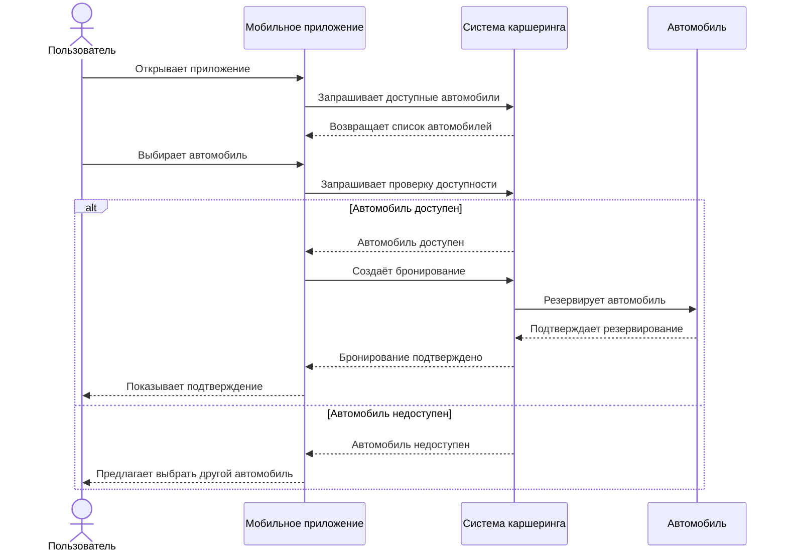

# Sequence Diagram — Бронирование автомобиля

```mermaid
sequenceDiagram
    actor Пользователь
    participant Приложение as Мобильное приложение
    participant Система as Система каршеринга
    participant Автомобиль

    Пользователь->>Приложение: Открывает приложение
    Приложение->>Система: Запрашивает доступные автомобили
    Система-->>Приложение: Возвращает список автомобилей
    Пользователь->>Приложение: Выбирает автомобиль
    Приложение->>Система: Запрашивает проверку доступности

    alt Автомобиль доступен
        Система-->>Приложение: Автомобиль доступен
        Приложение->>Система: Создаёт бронирование
        Система->>Автомобиль: Резервирует автомобиль
        Автомобиль-->>Система: Подтверждает резервирование
        Система-->>Приложение: Бронирование подтверждено
        Приложение-->>Пользователь: Показывает подтверждение
    else Автомобиль недоступен
        Система-->>Приложение: Автомобиль недоступен
        Приложение-->>Пользователь: Предлагает выбрать другой автомобиль
    end
```
