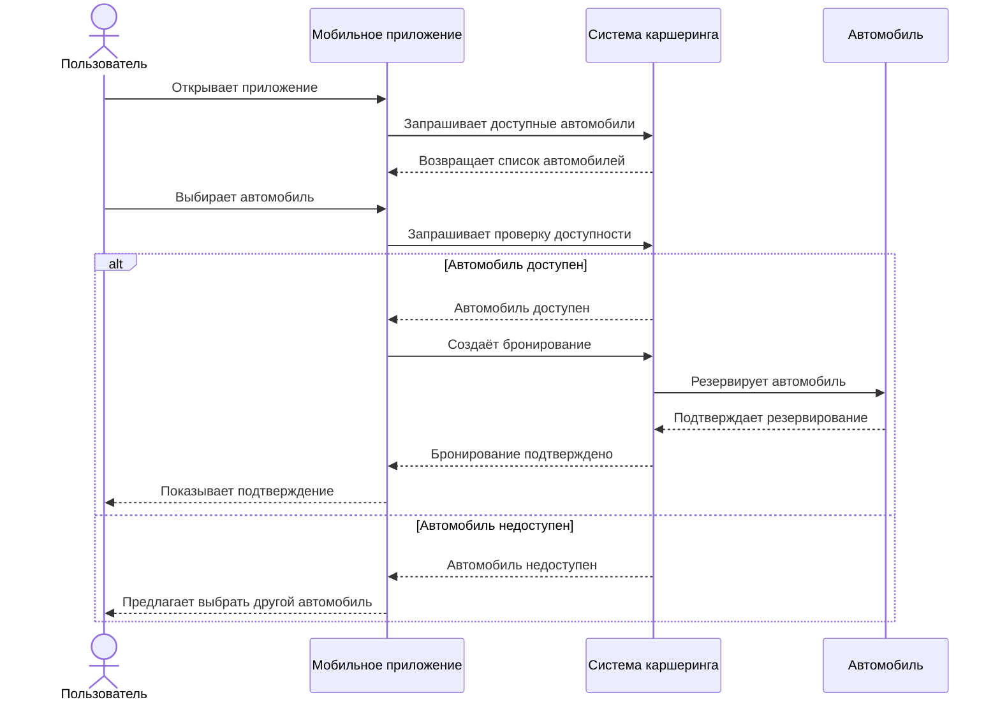
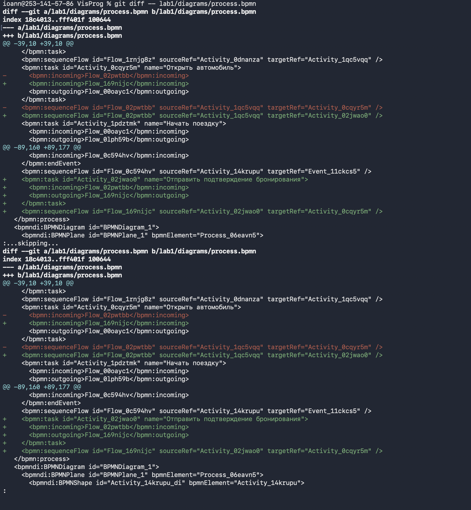
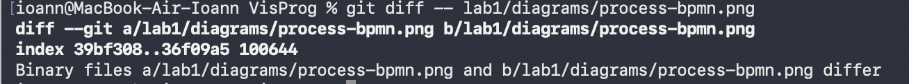

# Отчёт по лабораторной работе

## 1. Описание процесса

В лабораторной работе был рассмотрен процесс аренды автомобиля через сервис каршеринга. Пользователь заходит в приложение, выбирает подходящий автомобиль и проверяет его доступность. После этого автомобиль бронируется, пользователь начинает поездку, а после её окончания система рассчитывает стоимость и выполняет оплату.

## 2. Диаграммы

### BPMN-диаграмма


### UML Activity Diagram


### Sequence Diagram

Диаграмма показывает, как пользователь, приложение, система каршеринга и автомобиль взаимодействуют между собой во время бронирования автомобиля.


### Flowchart

Блок-схема показывает основные действия, которые выполняются при расчёте стоимости поездки.

```mermaid
flowchart TD
    A([Старт)) --> B[Получить длительность поездки]
    B --> C[Получить тариф за минуту]
    C --> D[Рассчитать стоимость]
    D --> E{Стоимость рассчитана?}
    E -->|Да| F[Показать итоговую стоимость]
    E -->|Нет| G[Повторить расчёт]
    G --> D
    F --> H([Конец])
```

## 3. Сравнение изменений с помощью Git diff

Во время лабораторной работы были внесены небольшие изменения в диаграммы. Для проверки изменений использовалась команда `git diff`.

Для файлов с текстовым содержимым изменения отображаются построчно. Например, в BPMN-файле можно увидеть добавленный элемент и изменения связей между элементами. Для PNG-файлов Git показывает, что бинарные файлы отличаются.

### Diff BPMN-файла

На скриншоте показаны изменения, которые были внесены в BPMN-диаграмму.



### Diff PNG-файла

На скриншоте показано сравнение PNG-файла после изменения диаграммы. Git определяет PNG как бинарный файл и не показывает изменения построчно.



## 4. Выводы

В ходе лабораторной работы я научился описывать один и тот же процесс с помощью разных видов диаграмм. Я разобрался с BPMN, UML Activity Diagram, диаграммой последовательности и блок-схемой. Также я научился сохранять диаграммы в нужных форматах и проверять изменения в файлах с помощью Git и команды `diff`. Это позволило увидеть разницу между изменениями в текстовых и бинарных файлах.
