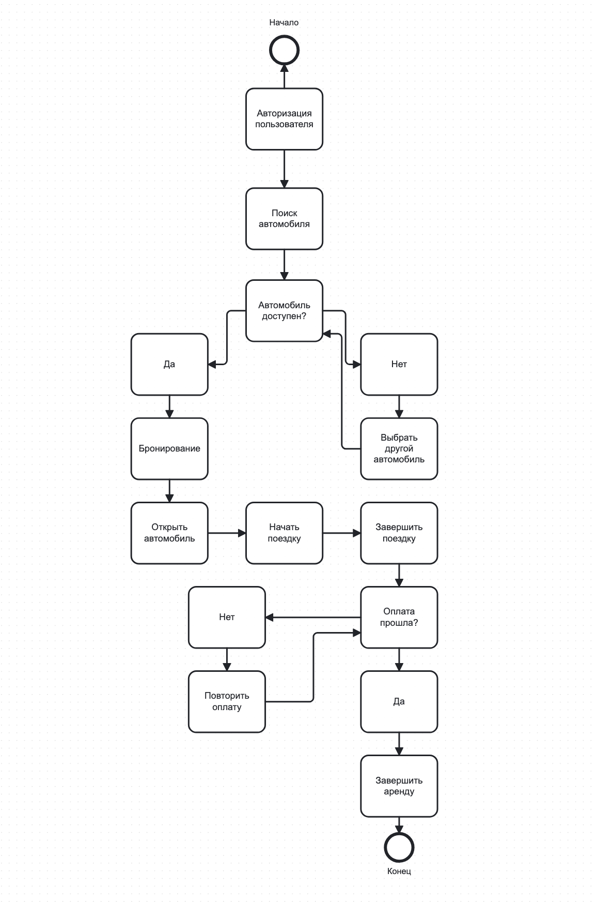
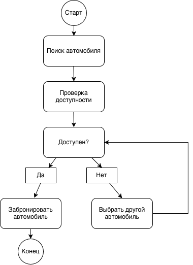

# Отчёт по лабораторной работе

## 1. Описание процесса

Здесь своими словами опиши процесс аренды автомобиля (каршеринг).
Напиши несколько предложений: кто участвует в процессе, что делает пользователь,
как система проверяет автомобиль, как происходит поездка и оплата.

## 2. Диаграммы

### BPMN-диаграмма

### UML Activity Diagram

### Sequence Diagram

Диаграмма последовательности описывает процесс бронирования автомобиля
и взаимодействие пользователя, приложения, системы каршеринга и автомобиля.

### Flowchart

Блок-схема показывает алгоритм расчёта стоимости поездки.

## 3. Выводы

Здесь своими словами напиши несколько предложений о том, что ты получил
после выполнения работы. Например, что научился описывать процесс с помощью
разных типов диаграмм, увидел различия между BPMN, UML Activity,
Sequence Diagram и блок-схемой, а также научился работать с изменениями
в Git и просматривать diff.