# Лабораторная работа №2. Node-RED

## 1. Цель работы

Изучить возможности визуальной среды Node-RED и получить практические навыки создания потоков обработки сообщений, работы с HTTP, MQTT, Dashboard, Telegram, файлами, контекстом и базой данных SQLite.

Для выполнения работы использовался Node-RED, запущенный в Docker-контейнере.

---

## 2. Используемое окружение

* ОС: macOS
* Docker Desktop
* Node-RED: `v5.0.7`
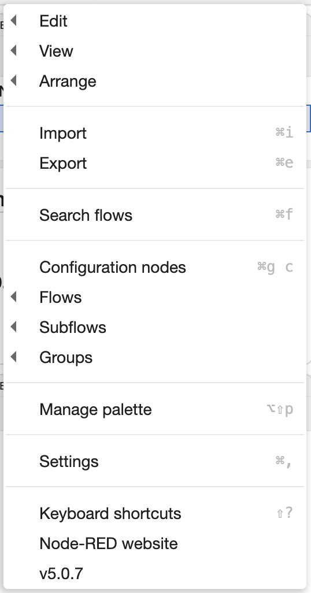

* Node.js: `v24.20.0`
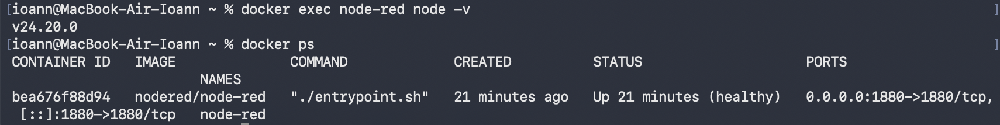

* Docker image: `nodered/node-red`
* SQLite для дополнительного задания

Node-RED запускался в Docker с пробросом порта `1880:1880` и подключением каталога:

```text
~/node-red-data:/data
```

Это позволяет сохранять данные Node-RED на компьютере.

---

## 3. Выполненные задания

### 3.1. Inject и Debug

Был создан первый поток:

```text
Inject → Debug
```

С помощью Inject передавалось сообщение с фамилией студента и заданным topic. Debug использовался для просмотра полученного сообщения.

**Flow:** [flow-01-inject-debug.json](../flows/flow-01-inject-debug.json)

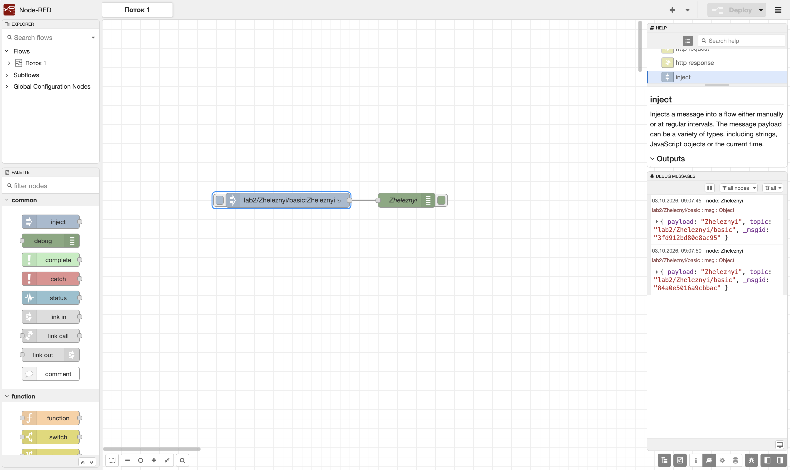

---

### 3.2. Function

Создан поток:

```text
Inject → Function → Debug
```

В Function выполнялась обработка числового значения, вычислялась сумма массива и выполнялась проверка значения.

**Flow:** [flow-02-function.json](../flows/flow-02-function.json)

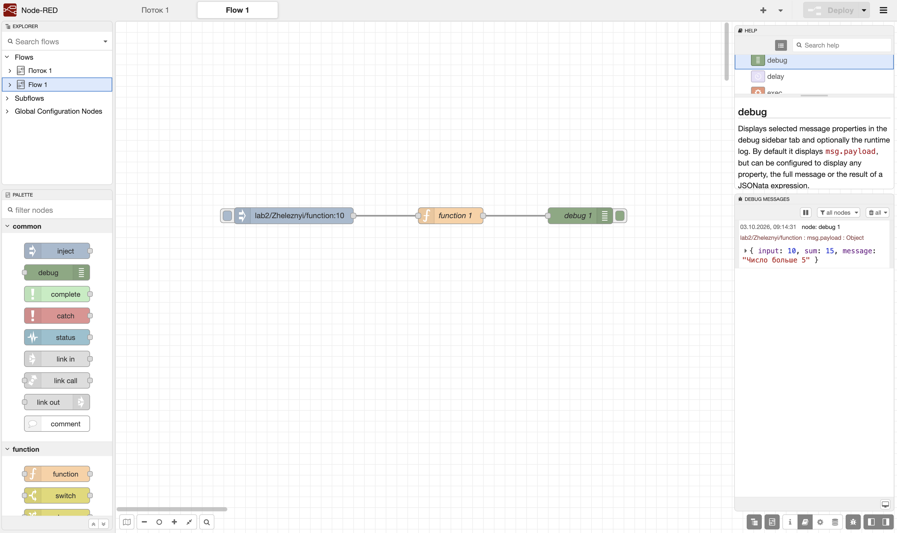

---

### 3.3. Switch

Создан поток:

```text
Inject → Function → Switch
                         ├→ Debug 1
                         └→ Debug 2
```

Switch проверяет значение `msg.payload` и направляет сообщение на разные выходы в зависимости от условия.

Использовались условия:

* значение больше 5;
* значение меньше или равно 5.

**Flow:** [flow-03-switch.json](../flows/flow-03-switch.json)

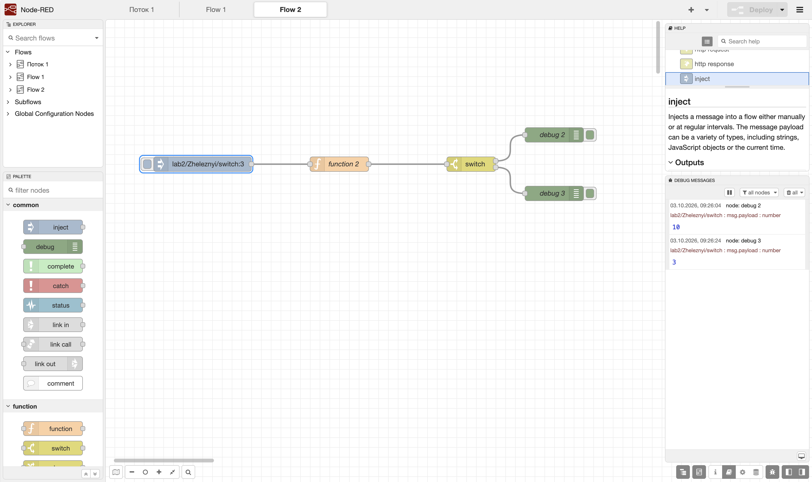

---

### 3.4. Change

Создан поток:

```text
Inject → Change → Debug
```

В Change изменялись свойства сообщения:

* `msg.topic`;
* `msg.timestamp`;
* `msg.payload`.

**Flow:** [flow-04-change.json](../flows/flow-04-change.json)

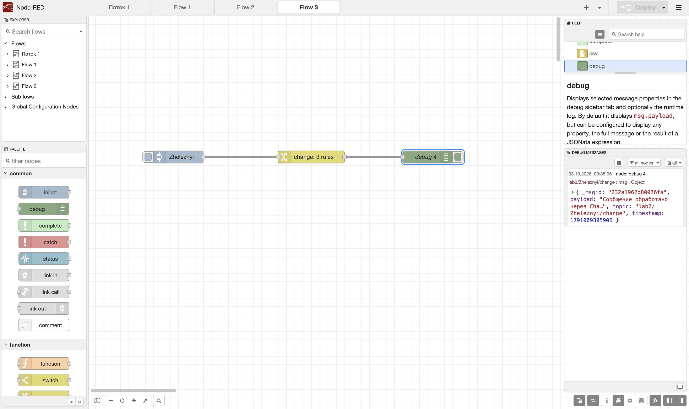

---

### 3.5. Template

Создан поток:

```text
Inject → Template → Debug
```

В Inject передавался JSON-объект с информацией о студенте и лабораторной работе.

Template с использованием Mustache формировал новый JSON.

**Flow:** [flow-05-template.json](../flows/flow-05-template.json)

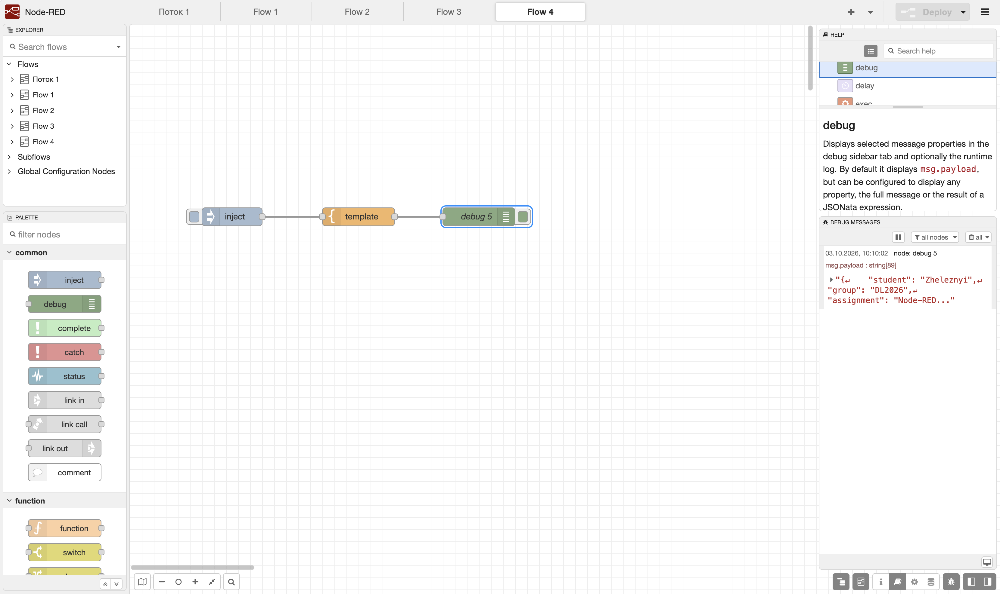

---

### 3.6. HTTP Request

Был создан поток:

```text
Inject → HTTP Request → Debug
```

HTTP Request использовался для получения данных от публичного API. Полученный ответ передавался в Debug.

**Flow:** [flow-06-http-request.json](../flows/flow-06-http-request.json)

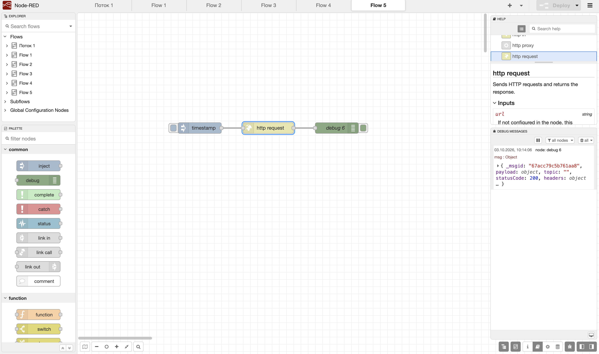

---

### 3.7. MQTT

Был создан поток для публикации и получения MQTT-сообщений:

```text
Inject → Function → MQTT Out
                       ↓
                  MQTT broker
                       ↓
                    MQTT In → Debug
```

Использовался публичный MQTT-брокер.

В Function генерировалось случайное числовое значение. Сообщение публиковалось в topic:

```text
student/Zheleznyi/lab2/random
```

MQTT In подписывался на тот же topic и получал опубликованные сообщения.

**Flow:** [flow-07-mqtt.json](../flows/flow-07-mqtt.json)

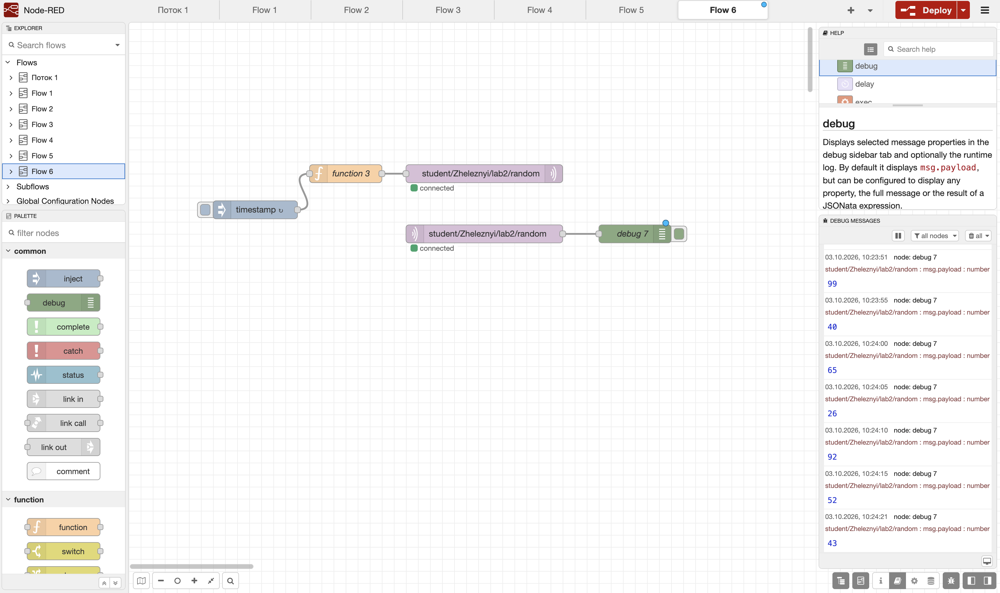

---

### 3.8. GET API

Были реализованы GET-эндпоинты:

```text
GET /api/text
GET /api/info
GET /api/items?id=...
```

`/api/text` возвращает текстовый ответ.

`/api/info` возвращает JSON с информацией о студенте и группе.

`/api/items` принимает параметр `id` и возвращает соответствующий объект. Для отсутствующего параметра используется код `400`, для неизвестного объекта — `404`.

Подробное описание API, параметров и ответов приведено в отдельном файле:

**[api.md](api.md)**

**Flow:** [flow-08-endpoints.json](../flows/flow-08-endpoints.json)

#### GET /api/text

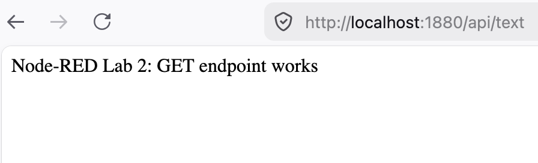

#### GET /api/info

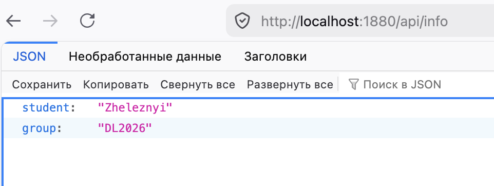

#### GET /api/items — успешный запрос

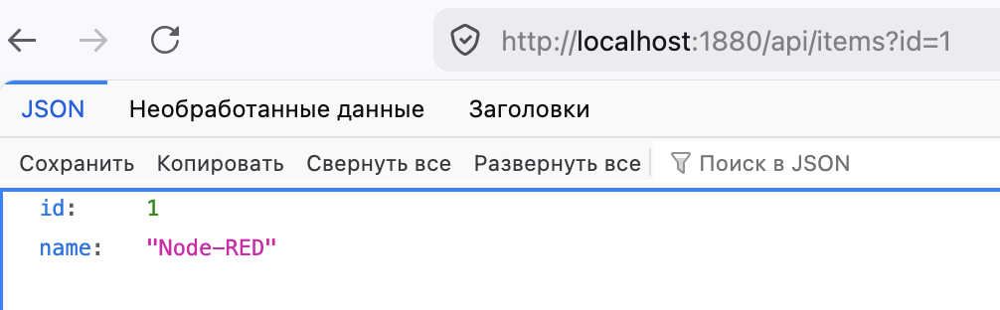

#### GET /api/items — ошибка

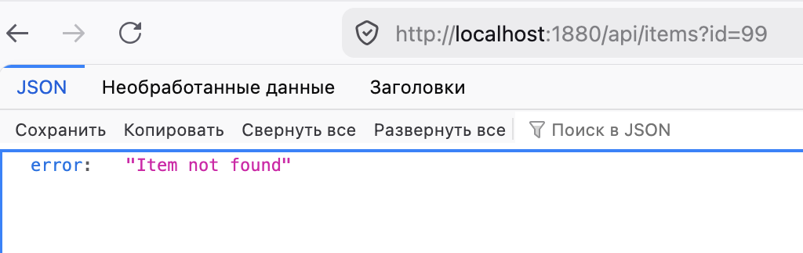

---

### 3.9. Dashboard

Был создан Dashboard для отображения температуры.

Схема:

```text
Inject → Function ──→ Gauge
                    └→ Chart
```

Function генерирует случайное значение температуры.

Gauge показывает текущее значение, а Chart отображает историю полученных значений.

Для температуры использовался диапазон от 0 до 40 °C.

**Flow:** [flow-09-dashboard.json](../flows/flow-09-dashboard.json)

#### Dashboard

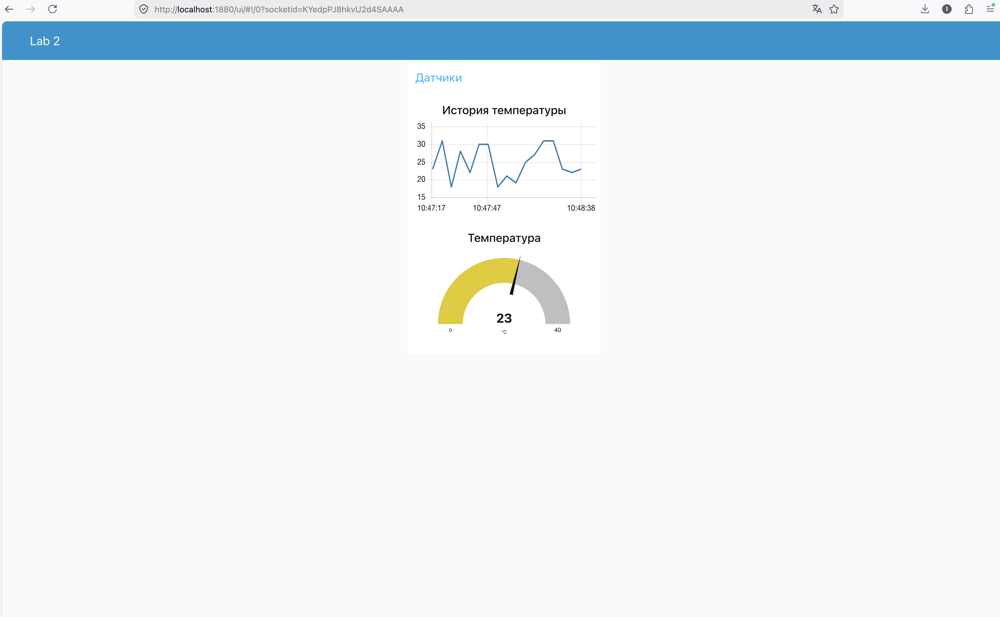

#### Flow Dashboard

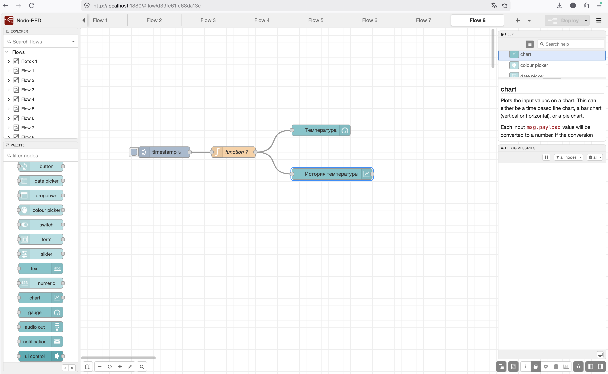

---

### 3.10. Telegram

Для работы с Telegram была предусмотрена дополнительная Node-RED-нода Telegram.

Основная схема:

```text
Telegram Receiver
       ↓
    Function
       ↓
Telegram Sender
```

В Function выполнялась обработка команд и обычных текстовых сообщений.

**Flow:** [flow-10-telegram.json](../flows/flow-10-telegram.json)


---

### 3.11. Работа с файлами

Были созданы два потока.

Запись:

```text
Inject → Function → File Write
```

Чтение:

```text
Inject → File Read → Debug
```

В файл записывалась информация о студенте, лабораторной работе и времени выполнения.

Файл сохранялся в каталоге `/data`, который связан с каталогом Node-RED на компьютере.

**Flow:** [flow-11-files.json](../flows/flow-11-files.json)

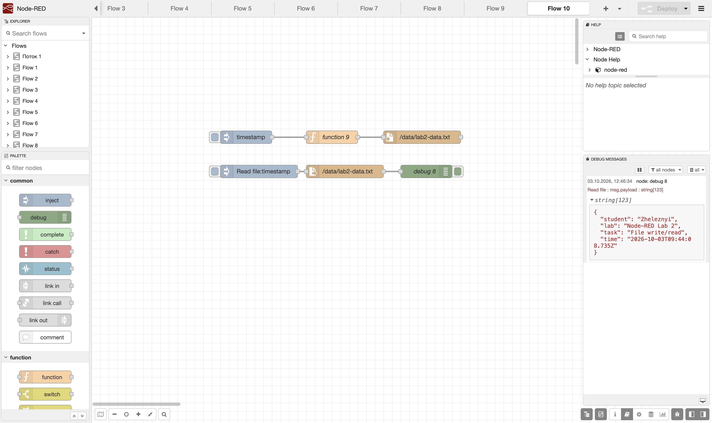

---

### 3.12. Flow Context

Для демонстрации контекста был создан счётчик.

Схема:

```text
Inject → Function → Debug
```

В Function использовался `flow context`:

```javascript
let counter = flow.get("counter") || 0;

counter++;

flow.set("counter", counter);
```

При каждом запуске Inject значение счётчика увеличивается.

Таким образом была проверена возможность хранения данных между сообщениями внутри одного flow.

**Flow:** [flow-12-context.json](../flows/flow-12-context.json)

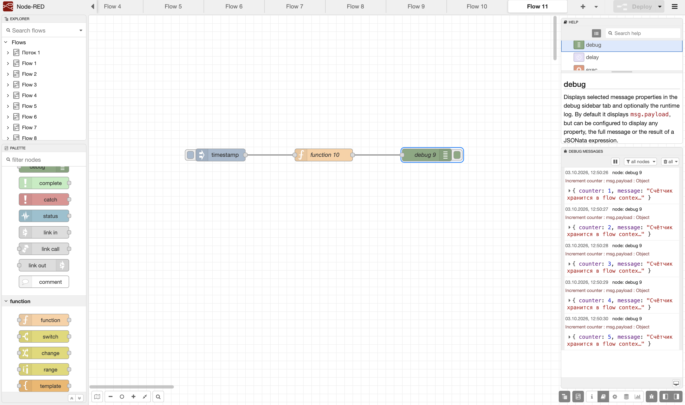

---

### 3.13. SQLite

В качестве ачивки была настроена работа Node-RED с SQLite.

Были созданы две таблицы:

```text
students
tasks
```

Таблица `students` содержит:

```text
id
name
group_name
```

Таблица `tasks` содержит:

```text
id
title
status
```

Для работы с базой были созданы отдельные потоки:

```text
Create students → SQLite
Create tasks → SQLite
Insert students → SQLite
Select students → SQLite
Insert tasks → SQLite
Select tasks → SQLite
```

В таблицу `students` были добавлены три записи:

```text
Zheleznyi
Ivanov
Petrov
```

В таблицу `tasks` были добавлены записи с заданиями лабораторной работы.

Для проверки сохранения данных был выполнен перезапуск Node-RED. После перезапуска данные снова были получены через `SELECT`, что подтвердило сохранение базы данных.

**Flow:** [flow-13-sqlite.json](../flows/flow-13-sqlite.json)

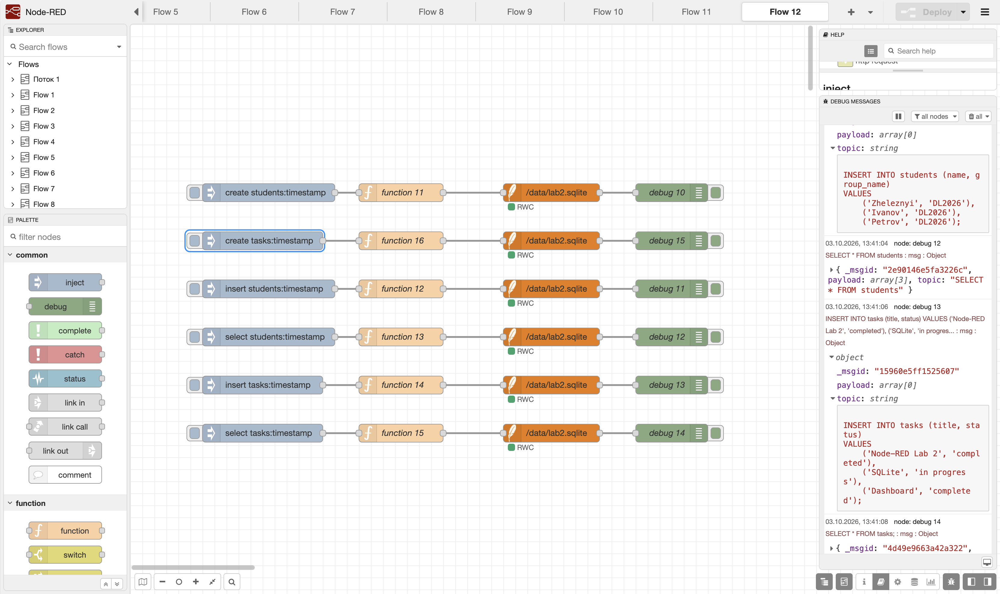

---

## 4. Освоенные Node-RED nodes

В ходе работы были изучены следующие основные nodes:

* Inject — создание и запуск сообщений;
* Debug — просмотр сообщений;
* Function — выполнение JavaScript-кода;
* Switch — условная маршрутизация сообщений;
* Change — изменение свойств сообщения;
* Template — формирование данных с использованием шаблонов;
* HTTP Request — выполнение HTTP-запросов;
* HTTP In — получение HTTP-запросов;
* HTTP Response — формирование HTTP-ответов;
* MQTT In — получение MQTT-сообщений;
* MQTT Out — отправка MQTT-сообщений;
* Dashboard nodes — отображение данных;
* Telegram nodes — получение и отправка сообщений Telegram;
* File nodes — чтение и запись файлов;
* SQLite — работа с локальной базой данных;
* Context — хранение состояния между сообщениями.

---

## 5. Использование AI

При выполнении лабораторной работы AI использовался как вспомогательный инструмент.

Основные типы запросов:

1. Объяснение назначения Node-RED nodes и их параметров.
2. Помощь в построении схем потоков.
3. Проверка и исправление JavaScript-кода в Function node.
4. Поиск причин ошибок при работе с HTTP, MQTT и SQLite.
5. Помощь с настройкой Docker и Node-RED.
6. Подготовка структуры документации и файлов лабораторной работы.

Примеры использованных запросов:

> Как настроить Function node в Node-RED, чтобы вычислить сумму массива и проверить число через if?

> Как сделать поток Inject → Function → Switch → Debug в Node-RED и разделить сообщения по условию?

> Как настроить MQTT Out и MQTT In через публичный MQTT-брокер?

> Как сделать GET API в Node-RED с параметром id и вернуть 400 или 404?

> Как подключить SQLite к Node-RED и сделать INSERT и SELECT через Inject?

AI использовался для получения объяснений и поиска вариантов реализации, а сами потоки, настройки и результаты проверялись непосредственно в Node-RED.

---

## 6. Результаты

В результате работы были созданы и проверены несколько независимых потоков Node-RED.

Были получены практические навыки:

* создания сообщений;
* обработки сообщений JavaScript-кодом;
* условного разделения потоков;
* работы с внешними HTTP API;
* обмена сообщениями через MQTT;
* создания HTTP API;
* отображения данных в Dashboard;
* работы с файлами;
* хранения состояния в Context;
* работы с SQLite.

Дополнительное задание с SQLite также было выполнено. После перезапуска Node-RED записи в базе данных сохранились.

Все основные потоки сохранены в формате JSON. Для каждого flow в отчёте приведён скриншот, а исходный JSON доступен по ссылке.

---

## 7. Вывод

В ходе лабораторной работы я познакомился с основными возможностями Node-RED и научился собирать из отдельных nodes полноценные потоки обработки данных.

На практике были рассмотрены Inject, Debug, Function, Switch, Change, Template, HTTP Request, HTTP API, MQTT, Dashboard, работа с файлами, Context и SQLite.

Отдельно была проверена работа с постоянным хранением данных. После перезапуска Node-RED записи SQLite не исчезли, поэтому было подтверждено сохранение данных между запусками.

Все созданные потоки сохранены в формате JSON и добавлены в репозиторий вместе со скриншотами и документацией.
